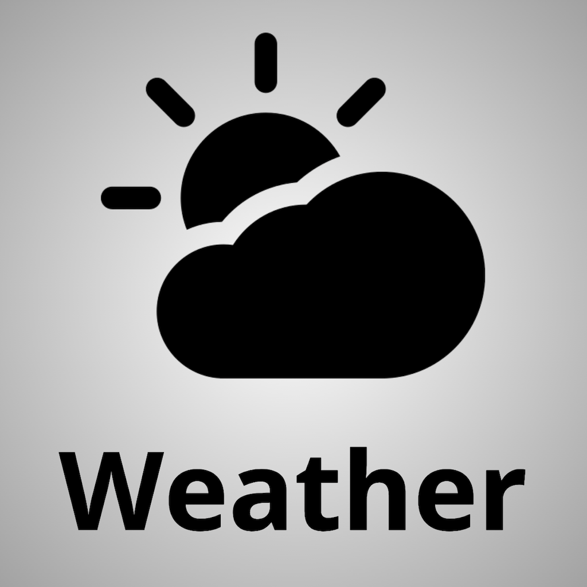

 

# Weather 

## Tecnical Stack:
* UIKit
* MVC
* UI in code
* URLSession
* CollectionView, TableView

## API
[OpenWeatherMap](https://openweathermap.org/)

## Description 
#### Weather application, displaying hourly weather and the week ahead.

## Screenshots:

  
  
  

## Contact me
[LinkedIn](https://www.linkedin.com/in/nikita-semennikov-73a020253/ "https://www.linkedin.com/in/nikita-semennikov-73a020253/") | [Telegram](https://t.me/NikitaAndreevich10 "@NikitaAndreevich10") | [Email](mailto:semennikovna@yandex.ru "semennikovna@yandex.ru")
